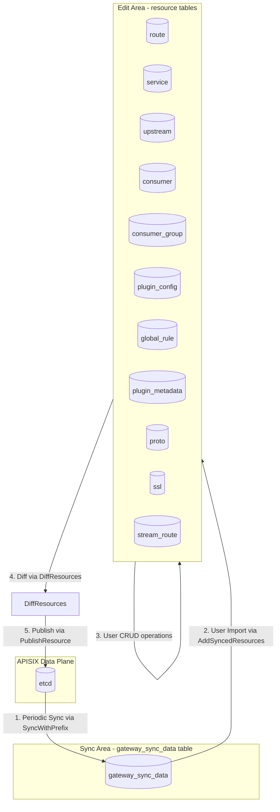
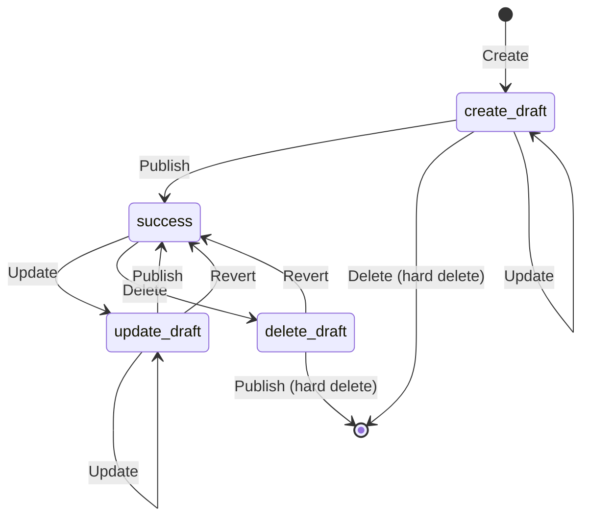
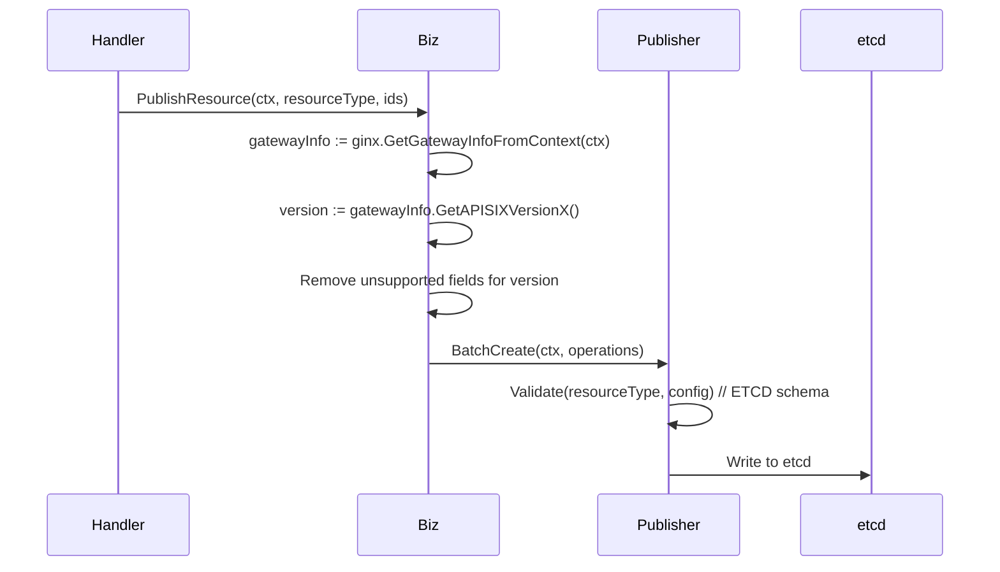

# AGENTS.md

## Code Architecture

The backend follows a layered architecture pattern:

**Call Chain**: `handler -> biz -> repo -> infras(database)`

```plaintext
pkg/
├── apis/           # HTTP handlers and routing
│   ├── basic/      # Basic API handlers
│   └── web/        # Web API handlers with session/CSRF middleware
├── biz/            # Business logic layer
│   ├── common.go   # Shared business logic for all APISIX resources
│   ├── consumer.go # Consumer-specific business logic
│   ├── route.go    # Route-specific business logic
│   └── ...         # Other resource-specific business logic
├── repo/           # Repository layer (generated code via gorm/gen)
│   └── *.gen.go    # Auto-generated repository code
├── infras/         # Infrastructure layer
│   ├── database/   # Database connections and operations
│   ├── storage/    # APISIX admin API client
│   ├── logging/    # Logging utilities
│   ├── trace/      # OpenTelemetry tracing
│   ├── sentry/     # Error tracking
│   └── leaderelection/ # Leader election for distributed scheduler
├── entity/         # Data structures
│   ├── model/      # Database models
│   ├── dto/        # Data transfer objects
│   ├── apisix/     # APISIX resource definitions
│   └── base/       # Base entities
├── middleware/     # Gin middlewares
│   ├── access_control.go # Access control
│   ├── user_auth.go     # User authentication
│   └── ...
├── publisher/      # Event publishing to etcd
├── config/         # Configuration management
├── utils/          # Utility functions
│   └── schema/     # APISIX JSON schema validation
│       ├── 3.11/   # Schema for APISIX 3.11
│       └── 3.13/   # Schema for APISIX 3.13
└── version/        # Version information
```

**Key Patterns**:

1. **Resource Management**: All APISIX resource types share common CRUD operations in `biz/common.go`, with resource-specific logic in separate files
2. **Schema Validation**: JSON schema validation for different APISIX versions (3.11, 3.13) in `pkg/utils/schema/`
3. **Publisher Pattern**: Changes are published to etcd for synchronization with data plane
4. **Repository Generation**: Use `gorm/gen` for type-safe database queries (run `make mock` to regenerate)
5. **Middleware Chain**: Web APIs use session, CSRF, user auth, and permission middlewares

## Layer Responsibilities

| Layer | Package | Key Responsibilities |
|-------|---------|---------------------|
| **Router** | `pkg/router` | Route registration and middleware mounting |
| **API** | `pkg/apis` | HTTP interface layer containing Handler and Serializer |
| **Middleware** | `pkg/middleware` | Authentication, CSRF protection, access control, gateway context injection |
| **Biz** | `pkg/biz` | Business logic, CRUD orchestration, state transitions, audit logging |
| **Status** | `pkg/status` | Resource state machine (FSM) for lifecycle management |
| **Publisher** | `pkg/publisher` | etcd publish operations with schema validation before write |
| **Repo** | `pkg/repo` | Database operations (auto-generated by gorm/gen, DO NOT edit manually) |
| **Infras** | `pkg/infras` | Infrastructure: DB connections, etcd client, logging, tracing |
| **Model** | `pkg/entity/model` | GORM models with HandleConfig hooks for field injection |
| **DTO** | `pkg/entity/dto` | Data transfer objects for inter-layer communication |

### API Layer Structure

The API layer (`pkg/apis`) is organized into multiple sub-modules to serve different consumers:

| Sub-module | Package | Description |
|------------|---------|-------------|
| **Web API** | `pkg/apis/web` | Management console API for frontend/admin operations |
| **Open API** | `pkg/apis/open` | Public API for external system integration |
| **Basic API** | `pkg/apis/basic` | Basic endpoints (health check, readiness, etc.) |
| **Common** | `pkg/apis/common` | Shared utilities and common response handling |

Each API sub-module contains:

- **Handler** - HTTP request handling, parameter binding, response formatting
- **Serializer** - Request/response struct definitions with validation tags

```plaintext
pkg/apis/
├── web/                    # Web API (Management Console)
│   ├── handler/            # Request handlers
│   └── serializer/         # Request/response serialization
├── open/                   # Open API (External Integration)
│   ├── handler/            # Request handlers
│   └── serializer/         # Request/response serialization
├── basic/                  # Basic API (Health, Readiness)
│   └── handler/            # Basic endpoint handlers
└── common/                 # Common utilities
    └── response.go         # Shared response handling
```

## Layer Dependency Rules

| Layer | Can Depend On | Must NOT Depend On |
|-------|---------------|-------------------|
| Handler | Serializer, Biz, Middleware | Repo, Publisher, Infras |
| Serializer | Model, DTO, Biz (partial) | Repo, Publisher |
| Middleware | Biz, Config, Utils | Handler, Serializer |
| Biz | Repo, Status, Publisher, Model, DTO, Infras | Handler, Middleware |
| Status | Constant, Config | Biz, Handler |
| Publisher | Infras/Storage, Constant | Biz, Handler |
| Repo | Model, Infras/Database | Biz, Handler |
| Infras | Config | Any business layer |
| Model/DTO | Constant | Any other layer |

## Design

### 1. Core Flow: Sync and Publish Lifecycle

The apiserver implements a **two-area resource management pattern** for managing APISIX configurations:



#### 1.1 Key Functions in the Flow

| Step | Function | File | Description |
|------|----------|------|-------------|
| 1. Sync | `SyncWithPrefix()` | `pkg/biz/unify_op.go` | Fetches resources from etcd, stores in `gateway_sync_data` |
| 1. Sync | `SyncerRun()` | `pkg/biz/unify_op.go` | Periodic scheduler that runs sync for all gateways |
| 2. Import | `AddSyncedResources()` | `pkg/biz/unify_op.go` | Copies synced resources to edit area tables |
| 3. CRUD | Various handlers | `pkg/apis/web/handler/*.go` | User creates/updates/deletes resources |
| 4. Diff | `DiffResources()` | `pkg/biz/unify_op.go` | Compares edit area with sync area |
| 5. Publish | `PublishResource()` | `pkg/biz/publish.go` | Writes changes to etcd |
| 5. Publish | `putXxx()` functions | `pkg/biz/publish.go` | Resource-specific publish logic |

#### 1.2 Two-Area Design Rationale

1. **Sync Area** (`gateway_sync_data` table): Read-only mirror of etcd state
   - Updated automatically by scheduler
   - Used for diff comparison
   - Source of truth for "what's deployed"

2. **Edit Area** (individual resource tables): User-editable staging area
   - Resources have draft states (create_draft, update_draft, delete_draft)
   - Changes don't affect APISIX until published
   - Supports rollback by reverting to sync area state

### 2. Resource State Machine

Resources follow a state machine pattern managed by `pkg/status/status.go` using the `looplab/fsm` library:



#### 2.1 State Definitions

| State | Constant | Description |
|-------|----------|-------------|
| `create_draft` | `ResourceStatusCreateDraft` | Newly created, not yet published to APISIX |
| `update_draft` | `ResourceStatusUpdateDraft` | Modified from published version, changes pending |
| `delete_draft` | `ResourceStatusDeleteDraft` | Marked for deletion, waiting for publish to remove from APISIX |
| `success` | `ResourceStatusSuccess` | Published and in sync with APISIX |

#### 2.2 Operations and State Transitions

| Current State | Operation | Next State | Notes |
|---------------|-----------|------------|-------|
| (none) | Create | `create_draft` | New resource enters draft state |
| `create_draft` | Publish | `success` | Resource written to etcd |
| `create_draft` | Delete | (deleted) | Hard delete, never published |
| `create_draft` | Update | `create_draft` | Stays in create_draft |
| `success` | Update | `update_draft` | Changes staged for publish |
| `success` | Delete | `delete_draft` | Deletion staged for publish |
| `update_draft` | Publish | `success` | Changes written to etcd |
| `update_draft` | Revert | `success` | Discard changes, restore from sync area |
| `update_draft` | Update | `update_draft` | More changes, stays in draft |
| `delete_draft` | Publish | (deleted) | Resource removed from etcd and DB |
| `delete_draft` | Revert | `success` | Cancel deletion |

#### 2.3 Usage in Code

```go
// Check if operation is allowed
statusOp := status.NewResourceStatusOp(resource)
err := statusOp.CanDo(ctx, constant.OperationTypePublish)

// Get next state after operation
nextStatus, err := statusOp.NextStatus(ctx, constant.OperationTypePublish)
```

### 3. Multi-Version APISIX Support

The system supports multiple APISIX versions (3.2.X, 3.3.X, 3.11.X, 3.13.X) with version-aware schema validation and field cleanup. Primary integration testing uses APISIX 3.11.

**Schema Breaking Change**: APISIX 3.x introduced `additionalProperties: false` which strictly enforces that NO extra fields are allowed beyond those defined in the schema.

#### 3.1 Version-Specific Field Support

| Resource | Field | 3.2.X | 3.3.X | 3.11.X | 3.13.X | Action |
|----------|-------|-------|-------|--------|--------|--------|
| `route` | name | Yes | Yes | Yes | Yes | Always keep |
| `service` | name | Yes | Yes | Yes | Yes | Always keep |
| `upstream` | name | Yes | Yes | Yes | Yes | Always keep |
| `plugin_config` | name | Yes | Yes | Yes | Yes | Always keep |
| `consumer` | id | No | No | No | No | Always remove (uses username) |
| `consumer_group` | name | No | No | No | Yes | Remove in < 3.13 |
| `stream_route` | name | No | No | No | Yes | Remove in < 3.13 |
| `proto` | name | No | No | No | Yes | Remove in < 3.13 |
| `global_rule` | name | No | No | No | No | Always remove |
| `ssl` | name | No | No | No | No | Always remove |

#### 3.2 Key Functions for Version Handling

```go
// pkg/constant/resource_schema.go

// Check if name field is supported for a version
ResourceSupportsNameFieldForVersion(resourceType, version) bool

// Check if field should be removed before publish
ShouldRemoveFieldBeforeValidationOrPublish(resourceType, fieldName, version) bool

// Check if resource requires ID in schema
ResourceRequiresIDInSchema(resourceType) bool
```

#### 3.3 Version Detection Flow



#### 3.4 Schema Verify and Update

the dir is `pkg/utils/schema/{version}/schema.json` and `pkg/utils/schema/{version}/plugin.json`

- schema.json is the schema for the APISIX resource.
- plugin.json is the schema for the APISIX plugin.

### 4. Resource Field Management

#### 4.1 HandleConfig Pattern

All resource models implement a `HandleConfig()` method called by GORM hooks (BeforeCreate/BeforeUpdate/BeforeSave) to inject fields into the `config` JSON column:

**Purpose**: Sync database column values into the config JSON for internal use and APISIX compatibility.

**Example** (`pkg/entity/model/route.go`):

```go
func (r *Route) HandleConfig() error {
    // Inject id and name
    r.Config, _ = sjson.SetBytes(r.Config, "id", r.ID)
    if r.Name != "" {
        r.Config, _ = sjson.SetBytes(r.Config, "name", r.Name)
    }
    // Inject association fields (required by APISIX)
    if r.ServiceID != "" {
        r.Config, _ = sjson.SetBytes(r.Config, "service_id", r.ServiceID)
    }
    return nil
}
```

**Field Categories**:

1. **Identity fields** (`id`, `name`): Duplicated from columns, removed before publish based on version
2. **Association fields** (`service_id`, `upstream_id`, `plugin_config_id`): Required by APISIX, kept during publish
3. **Internal fields** (`validity_start`, `validity_end` for SSL): Never sent to APISIX

#### 4.2 Publish Field Cleanup

Before publishing to APISIX/etcd, `pkg/biz/publish.go` removes fields based on version compatibility using `ShouldRemoveFieldBeforeValidationOrPublish()`.

### 5. Schema Validation

#### 5.1 DATABASE Validation

- **When**: Middleware validation of user input (before HandleConfig injection)
- **Purpose**: Validate user-provided config is valid for APISIX
- **Constraint**: Looser, allows missing fields that HandleConfig will inject
- **Datatype**: `constant.DatatypeDATABASE`
- **Example**: User doesn't need to provide `id` for consumer_group (auto-generated)

#### 5.2 ETCD Validation

- **When**: Publisher validation before writing to etcd (after HandleConfig and field cleanup)
- **Purpose**: Ensure config sent to APISIX is complete and valid
- **Constraint**: Strict, `additionalProperties: false`, all required fields must be present
- **Datatype**: `constant.DatatypeETCD`
- **Example**: consumer_group MUST have `id` in config when publishing to APISIX 3.11/3.13

### 5.3 Validation Flow

```plaintext
User Request (without id/name)
    ↓
[Middleware] DATABASE Validation
    - Validates user input
    - Injects ID if required by schema (consumer_group, plugin_config, global_rule)
    ✅ PASS
    ↓
[Handler] Process Request
    ↓
[Model.HandleConfig()] GORM Hook
    - Injects id, name, association fields into config
    - Saves to database
    ↓
[Publish] Read from Database
    - Get gateway APISIX version
    - Remove fields not supported in that version
    ↓
[Publisher] ETCD Validation
    - Validates cleaned config
    - Strict validation with additionalProperties: false
    ✅ PASS
    ↓
Write to etcd → APISIX
```

## Build and test commands

**Go Version Requirement**: Go 1.25.5+

check go version first,

- if `src/apiserver/.envrc` is present, try to use it(source the file first).
- or try to use `/root/.gvm/gos/go1.25.5/bin/go` if the first one is not present.
- or ask the user to provide

```shell
# Check Go version
go version
```

There is a @Makefile in the `src/apiserver` directory, you can use it to build and test the project.

### Build

```shell
# update the dependencies
make dep

# build the binary
make build
```

### Test

```shell
# run unittest
make test

# run single test
go test ./pkg/biz -run TestPublishConsumerGroups -v

# clear test cache
go clean -testcache

```

### Integration Test

Integration tests in tests/integration/ with Docker Compose setup

```shell
# run integration test
make integration-test
```

### Code Quality

```shell
# run code quality check, it will run fmt, vet, lint commands.
make lint
```

always run the commands before you finish your coding work, and fix the issues if any.

## Local Tools Installed

- `ag` and `grep` for command-line text search
- `jq` for command-line JSON processing

## Important Notes

- License Headers: All Go files must have license headers (auto-added by pre-commit hook)
- Vendor Dependencies: Run make dep after modifying go.mod to update vendor directory
- Database Migrations: Use ./apiserver migrate command for schema changes
- Two Validation Contexts: Remember DATABASE (input) vs ETCD (output) have different requirements