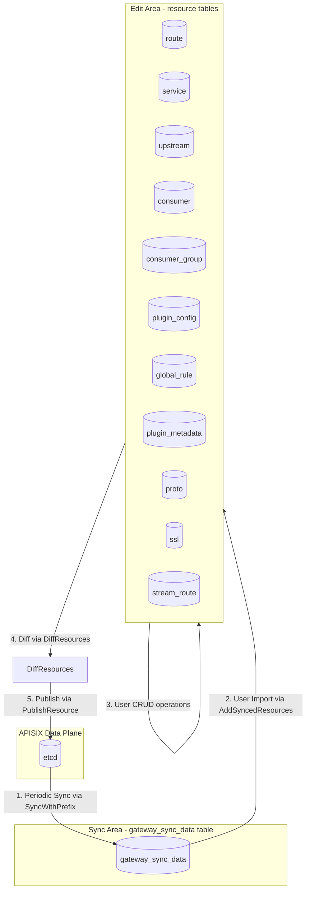
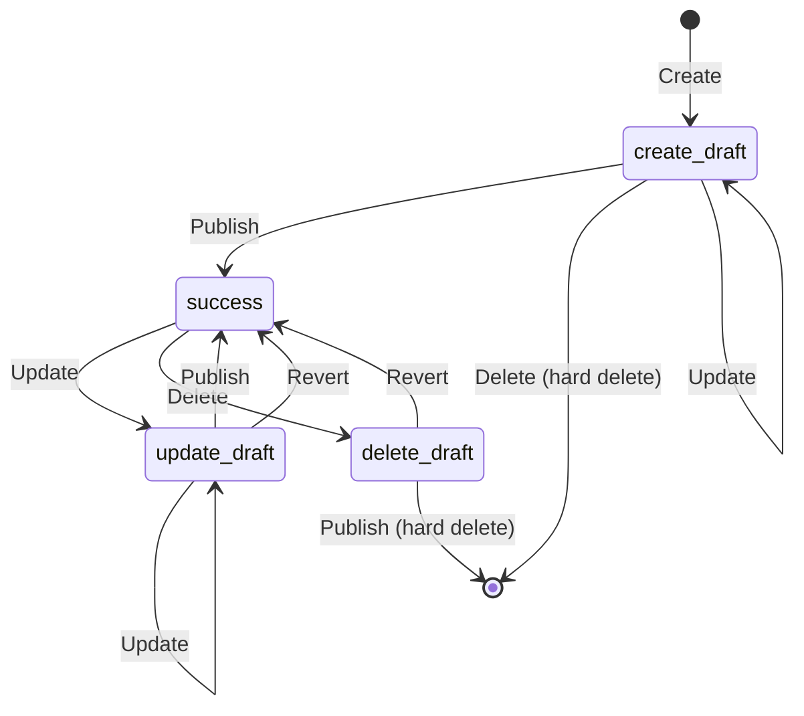
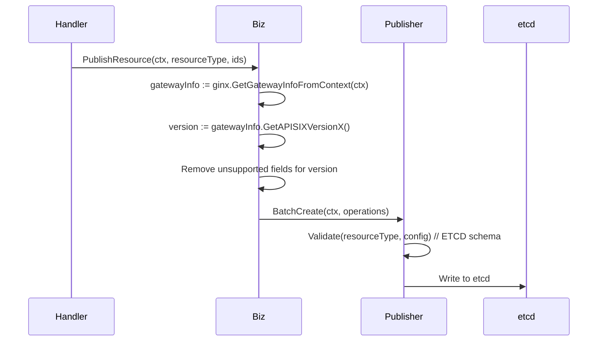
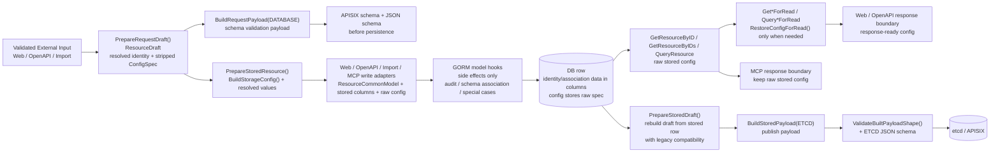
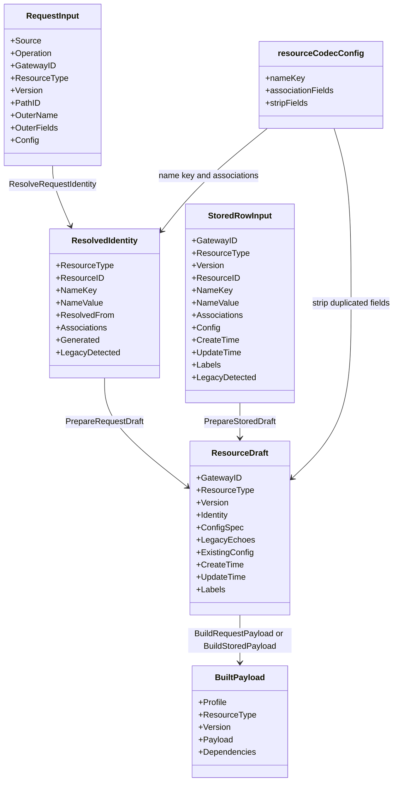

# AGENTS.md

## Code Architecture

The backend follows a layered architecture pattern:

**Call Chain**: `handler -> biz -> repo -> infras(database)`

```plaintext
pkg/
├── apis/           # HTTP handlers and routing
│   ├── basic/      # Basic API handlers
│   └── web/        # Web API handlers with session/CSRF middleware
├── biz/            # Business logic layer
│   ├── common.go   # Shared business logic for all APISIX resources
│   ├── consumer.go # Consumer-specific business logic
│   ├── route.go    # Route-specific business logic
│   └── ...         # Other resource-specific business logic
├── repo/           # Repository layer (generated code via gorm/gen)
│   └── *.gen.go    # Auto-generated repository code
├── infras/         # Infrastructure layer
│   ├── database/   # Database connections and operations
│   ├── storage/    # APISIX admin API client
│   ├── logging/    # Logging utilities
│   ├── trace/      # OpenTelemetry tracing
│   ├── sentry/     # Error tracking
│   └── leaderelection/ # Leader election for distributed scheduler
├── entity/         # Data structures
│   ├── model/      # Database models
│   ├── dto/        # Data transfer objects
│   ├── apisix/     # APISIX resource definitions
│   └── base/       # Base entities
├── middleware/     # Gin middlewares
│   ├── access_control.go # Access control
│   ├── user_auth.go     # User authentication
│   └── ...
├── publisher/      # Event publishing to etcd
├── config/         # Configuration management
├── utils/          # Utility functions
│   └── schema/     # APISIX JSON schema validation
│       ├── 3.11/   # Schema for APISIX 3.11
│       └── 3.13/   # Schema for APISIX 3.13
└── version/        # Version information
```

**Key Patterns**:

1. **Resource Management**: All APISIX resource types share common CRUD operations in `biz/common.go`, with resource-specific logic in separate files
2. **Schema Validation**: JSON schema validation for different APISIX versions (3.11, 3.13) in `pkg/utils/schema/`
3. **Publisher Pattern**: Changes are published to etcd for synchronization with data plane
4. **Repository Generation**: Use `gorm/gen` for type-safe database queries (run `make mock` to regenerate)
5. **Middleware Chain**: Web APIs use session, CSRF, user auth, and permission middlewares

## Layer Responsibilities

| Layer | Package | Key Responsibilities |
|-------|---------|---------------------|
| **Router** | `pkg/router` | Route registration and middleware mounting |
| **API** | `pkg/apis` | HTTP interface layer containing Handler and Serializer |
| **Middleware** | `pkg/middleware` | Authentication, CSRF protection, access control, gateway context injection |
| **Biz** | `pkg/biz` | Business logic, CRUD orchestration, state transitions, audit logging |
| **Status** | `pkg/status` | Resource state machine (FSM) for lifecycle management |
| **Publisher** | `pkg/publisher` | etcd publish operations with schema validation before write |
| **Repo** | `pkg/repo` | Database operations (auto-generated by gorm/gen, DO NOT edit manually) |
| **Infras** | `pkg/infras` | Infrastructure: DB connections, etcd client, logging, tracing |
| **Model** | `pkg/entity/model` | GORM models with HandleConfig hooks for field injection |
| **DTO** | `pkg/entity/dto` | Data transfer objects for inter-layer communication |

### API Layer Structure

The API layer (`pkg/apis`) is organized into multiple sub-modules to serve different consumers:

| Sub-module | Package | Description |
|------------|---------|-------------|
| **Web API** | `pkg/apis/web` | Management console API for frontend/admin operations |
| **Open API** | `pkg/apis/open` | Public API for external system integration |
| **Basic API** | `pkg/apis/basic` | Basic endpoints (health check, readiness, etc.) |
| **Common** | `pkg/apis/common` | Shared utilities and common response handling |

Each API sub-module contains:

- **Handler** - HTTP request handling, parameter binding, response formatting
- **Serializer** - Request/response struct definitions with validation tags

```plaintext
pkg/apis/
├── web/                    # Web API (Management Console)
│   ├── handler/            # Request handlers
│   └── serializer/         # Request/response serialization
├── open/                   # Open API (External Integration)
│   ├── handler/            # Request handlers
│   └── serializer/         # Request/response serialization
├── basic/                  # Basic API (Health, Readiness)
│   └── handler/            # Basic endpoint handlers
└── common/                 # Common utilities
    └── response.go         # Shared response handling
```

## Layer Dependency Rules

| Layer | Can Depend On | Must NOT Depend On |
|-------|---------------|-------------------|
| Handler | Serializer, Biz, Middleware | Repo, Publisher, Infras |
| Serializer | Model, DTO, Biz (partial) | Repo, Publisher |
| Middleware | Biz, Config, Utils | Handler, Serializer |
| Biz | Repo, Status, Publisher, Model, DTO, Infras | Handler, Middleware |
| Status | Constant, Config | Biz, Handler |
| Publisher | Infras/Storage, Constant | Biz, Handler |
| Repo | Model, Infras/Database | Biz, Handler |
| Infras | Config | Any business layer |
| Model/DTO | Constant | Any other layer |

## Design

### 1. Core Flow: Sync and Publish Lifecycle

The apiserver implements a **two-area resource management pattern** for managing APISIX configurations:


```mermaid
flowchart TD
    subgraph etcdLayer [APISIX Data Plane]
        ETCD[(etcd)]
    end

    subgraph syncArea [Sync Area - gateway_sync_data table]
        SyncData[(gateway_sync_data)]
    end

    subgraph editArea [Edit Area - resource tables]
        Route[(route)]
        Service[(service)]
        Upstream[(upstream)]
        Consumer[(consumer)]
        ConsumerGroup[(consumer_group)]
        PluginConfig[(plugin_config)]
        GlobalRule[(global_rule)]
        PluginMetadata[(plugin_metadata)]
        Proto[(proto)]
        SSL[(ssl)]
        StreamRoute[(stream_route)]
    end

    ETCD -->|"1. Periodic Sync via SyncWithPrefix"| SyncData
    SyncData -->|"2. User Import via AddSyncedResources"| editArea
    editArea -->|"3. User CRUD operations"| editArea
    editArea -->|"4. Diff via DiffResources"| DiffEngine[DiffResources]
    DiffEngine -->|"5. Publish via PublishResource"| ETCD
```

#### 1.1 Key Functions in the Flow

| Step | Function | File | Description |
|------|----------|------|-------------|
| 1. Sync | `SyncWithPrefix()` | `pkg/biz/unify_op.go` | Fetches resources from etcd, stores in `gateway_sync_data` |
| 1. Sync | `SyncerRun()` | `pkg/biz/unify_op.go` | Periodic scheduler that runs sync for all gateways |
| 2. Import | `AddSyncedResources()` | `pkg/biz/unify_op.go` | Copies synced resources to edit area tables |
| 3. CRUD | Various handlers | `pkg/apis/web/handler/*.go` | User creates/updates/deletes resources |
| 4. Diff | `DiffResources()` | `pkg/biz/unify_op.go` | Compares edit area with sync area |
| 5. Publish | `PublishResource()` | `pkg/biz/publish.go` | Writes changes to etcd |
| 5. Publish | `putXxx()` functions | `pkg/biz/publish.go` | Resource-specific publish logic |

#### 1.2 Two-Area Design Rationale

1. **Sync Area** (`gateway_sync_data` table): Read-only mirror of etcd state
   - Updated automatically by scheduler
   - Used for diff comparison
   - Source of truth for "what's deployed"

2. **Edit Area** (individual resource tables): User-editable staging area
   - Resources have draft states (create_draft, update_draft, delete_draft)
   - Changes don't affect APISIX until published
   - Supports rollback by reverting to sync area state

### 2. Resource State Machine

Resources follow a state machine pattern managed by `pkg/status/status.go` using the `looplab/fsm` library:


```mermaid
stateDiagram-v2
    [*] --> create_draft: Create
    create_draft --> success: Publish
    create_draft --> [*]: Delete (hard delete)
    create_draft --> create_draft: Update

    success --> update_draft: Update
    success --> delete_draft: Delete

    update_draft --> success: Publish
    update_draft --> success: Revert
    update_draft --> update_draft: Update

    delete_draft --> success: Revert
    delete_draft --> [*]: Publish (hard delete)
```

#### 2.1 State Definitions

| State | Constant | Description |
|-------|----------|-------------|
| `create_draft` | `ResourceStatusCreateDraft` | Newly created, not yet published to APISIX |
| `update_draft` | `ResourceStatusUpdateDraft` | Modified from published version, changes pending |
| `delete_draft` | `ResourceStatusDeleteDraft` | Marked for deletion, waiting for publish to remove from APISIX |
| `success` | `ResourceStatusSuccess` | Published and in sync with APISIX |

#### 2.2 Operations and State Transitions

| Current State | Operation | Next State | Notes |
|---------------|-----------|------------|-------|
| (none) | Create | `create_draft` | New resource enters draft state |
| `create_draft` | Publish | `success` | Resource written to etcd |
| `create_draft` | Delete | (deleted) | Hard delete, never published |
| `create_draft` | Update | `create_draft` | Stays in create_draft |
| `success` | Update | `update_draft` | Changes staged for publish |
| `success` | Delete | `delete_draft` | Deletion staged for publish |
| `update_draft` | Publish | `success` | Changes written to etcd |
| `update_draft` | Revert | `success` | Discard changes, restore from sync area |
| `update_draft` | Update | `update_draft` | More changes, stays in draft |
| `delete_draft` | Publish | (deleted) | Resource removed from etcd and DB |
| `delete_draft` | Revert | `success` | Cancel deletion |

#### 2.3 Usage in Code

```go
// Check if operation is allowed
statusOp := status.NewResourceStatusOp(resource)
err := statusOp.CanDo(ctx, constant.OperationTypePublish)

// Get next state after operation
nextStatus, err := statusOp.NextStatus(ctx, constant.OperationTypePublish)
```

### 3. Multi-Version APISIX Support

The system supports multiple APISIX versions (3.2.X, 3.3.X, 3.11.X, 3.13.X) with version-aware schema validation and field cleanup. Primary integration testing uses APISIX 3.11.

**Schema Breaking Change**: APISIX 3.x introduced `additionalProperties: false` which strictly enforces that NO extra fields are allowed beyond those defined in the schema.

#### 3.1 Version-Specific Field Support

| Resource | Field | 3.2.X | 3.3.X | 3.11.X | 3.13.X | Action |
|----------|-------|-------|-------|--------|--------|--------|
| `route` | name | Yes | Yes | Yes | Yes | Always keep |
| `service` | name | Yes | Yes | Yes | Yes | Always keep |
| `upstream` | name | Yes | Yes | Yes | Yes | Always keep |
| `plugin_config` | name | Yes | Yes | Yes | Yes | Always keep |
| `consumer` | id | No | No | No | No | Always remove (uses username) |
| `consumer_group` | name | No | No | No | Yes | Remove in < 3.13 |
| `stream_route` | name | No | No | No | Yes | Remove in < 3.13 |
| `proto` | name | No | No | No | Yes | Remove in < 3.13 |
| `global_rule` | name | No | No | No | No | Always remove |
| `ssl` | name | No | No | No | No | Always remove |

#### 3.2 Key Functions for Version Handling

```go
// pkg/constant/resource_schema.go

// Check if name field is supported for a version
ResourceSupportsNameFieldForVersion(resourceType, version) bool

// Check if field should be removed before publish
ShouldRemoveFieldBeforeValidationOrPublish(resourceType, fieldName, version) bool

// Check if resource requires ID in schema
ResourceRequiresIDInSchema(resourceType) bool
```

#### 3.3 Version Detection Flow


```mermaid
sequenceDiagram
    participant Handler
    participant Biz
    participant Publisher
    participant etcd

    Handler->>Biz: PublishResource(ctx, resourceType, ids)
    Biz->>Biz: gatewayInfo := ginx.GetGatewayInfoFromContext(ctx)
    Biz->>Biz: version := gatewayInfo.GetAPISIXVersionX()
    Biz->>Biz: Remove unsupported fields for version
    Biz->>Publisher: BatchCreate(ctx, operations)
    Publisher->>Publisher: Validate(resourceType, config) // ETCD schema
    Publisher->>etcd: Write to etcd
```

#### 3.4 Schema Verify and Update

the dir is `pkg/utils/schema/{version}/schema.json` and `pkg/utils/schema/{version}/plugin.json`

- schema.json is the schema for the APISIX resource.
- plugin.json is the schema for the APISIX plugin.

### 4. Config Validation Refactor (Feature 001)

#### 4.1 Spec Summary

The `specs/001-config-validation-refactor/` feature reshapes validation around one shared internal draft and one shared payload-building path.

- Runtime terminology in code is `Prepare*` and `Build*`, centered on `pkg/resourcecodec/`
- Web, OpenAPI, import, stored-row compatibility, and publish should converge on the same draft/payload pipeline
- Keep Web and OpenAPI wire contracts stable by default; do not assume serializer or frontend changes are allowed
- Keep database schema stable by default; model columns remain the stored fields for identity and association data
- Validate accepted data twice: `DATABASE` profile before persistence and `ETCD` profile before publish
- Preserve legacy stored rows that still echo `id`, `name`, or association fields inside `config`
- Treat regression coverage as part of the feature contract before changing request/import/publish validation behavior

#### 4.2 Current Runtime Flow

The old mental model of "request validation first, then `HandleConfig()` fills in the real payload later" is no longer the primary path. The current runtime flow for validated write paths is request draft preparation plus payload building in `pkg/resourcecodec/`, with response restoration and publish rebuild handled as separate downstream boundaries.


```mermaid
flowchart LR
    Req["Validated External Input<br/>Web / OpenAPI / Import"] --> Draft["PrepareRequestDraft()<br/>ResourceDraft<br/>resolved identity + stripped ConfigSpec"]

    Draft --> DBValidate["BuildRequestPayload(DATABASE)<br/>schema validation payload"]
    DBValidate --> Schema["APISIX schema + JSON schema<br/>before persistence"]

    Draft --> StoreConfig["PrepareStoredResource()<br/>BuildStorageConfig() + resolved values"]
    StoreConfig --> Persist["Web / OpenAPI / Import / MCP write adapters<br/>ResourceCommonModel + stored columns + raw config"]
    Persist --> Hooks["GORM model hooks<br/>side effects only<br/>audit / schema association / special cases"]
    Hooks --> DB[("DB row<br/>identity/association data in columns<br/>config stores raw spec")]

    DB --> InternalRead["GetResourceByID / GetResourceByIDs / QueryResource<br/>raw stored config"]
    InternalRead --> ReadRestore["Get*ForRead / Query*ForRead<br/>RestoreConfigForRead() only when needed"]
    ReadRestore --> WebResp["Web / OpenAPI response boundary<br/>response-ready config"]
    InternalRead --> MCPResp["MCP response boundary<br/>keep raw stored config"]

    DB --> StoredDraft["PrepareStoredDraft()<br/>rebuild draft from stored row<br/>with legacy compatibility"]
    StoredDraft --> ETCDBuild["BuildStoredPayload(ETCD)<br/>publish payload"]
    ETCDBuild --> PublishValidate["ValidateBuiltPayloadShape()<br/>+ ETCD JSON schema"]
    PublishValidate --> ETCD[("etcd / APISIX")]
```

Important distinction:

- `BuildRequestPayload(DATABASE)` is the request-time validation shape, not the object written directly to MySQL.
- `PrepareStoredResource()` / `BuildStorageConfig()` produce raw stored config from `ConfigSpec`; new writes store resolved identity and association fields separately instead of echoing them back into `config`.
- Internal biz reads stay raw. Web and OpenAPI opt into `*ForRead` helpers that restore response fields at the response boundary, while MCP intentionally returns raw stored config.
- Publish later rebuilds a fresh `ETCD` payload from the stored row rather than reusing the request-side `BuiltPayload`.

OpenAPI create has one extra optimization: `pkg/middleware/openapi_resource_check.go` caches resolved drafts in Gin context, and `pkg/apis/open/serializer/resource.go` reuses them in `ToCommonResourceWithDrafts()` so create does not need to resolve identity twice.

#### 4.3 Key Structs


```mermaid
classDiagram
    class RequestInput {
        +Source
        +Operation
        +GatewayID
        +ResourceType
        +Version
        +PathID
        +OuterName
        +OuterFields
        +Config
    }

    class ResolvedIdentity {
        +ResourceType
        +ResourceID
        +NameKey
        +NameValue
        +ResolvedFrom
        +Associations
        +Generated
        +LegacyDetected
    }

    class ResourceDraft {
        +GatewayID
        +ResourceType
        +Version
        +Identity
        +ConfigSpec
        +LegacyEchoes
        +ExistingConfig
        +CreateTime
        +UpdateTime
        +Labels
    }

    class BuiltPayload {
        +Profile
        +ResourceType
        +Version
        +Payload
        +Dependencies
    }

    class StoredRowInput {
        +GatewayID
        +ResourceType
        +Version
        +ResourceID
        +NameKey
        +NameValue
        +Associations
        +Config
        +CreateTime
        +UpdateTime
        +Labels
        +LegacyDetected
    }

    class resourceCodecConfig {
        +nameKey
        +associationFields
        +stripFields
    }

    RequestInput --> ResolvedIdentity : ResolveRequestIdentity
    ResolvedIdentity --> ResourceDraft : PrepareRequestDraft
    StoredRowInput --> ResourceDraft : PrepareStoredDraft
    ResourceDraft --> BuiltPayload : BuildRequestPayload or BuildStoredPayload
    resourceCodecConfig --> ResolvedIdentity : name key and associations
    resourceCodecConfig --> ResourceDraft : strip duplicated fields
```

#### 4.4 Key Struct Intent

| Type | File | Purpose |
|------|------|---------|
| `RequestInput` | `pkg/resourcecodec/types.go` | External request/import shape before normalization |
| `ResolvedIdentity` | `pkg/resourcecodec/types.go` | One resolved ID/name/association result for a lifecycle operation |
| `ResourceDraft` | `pkg/resourcecodec/types.go` | Shared internal draft used by request validation, storage shaping, and publish rebuilding |
| `BuiltPayload` | `pkg/resourcecodec/types.go` | Version-aware `DATABASE` or `ETCD` payload used for schema validation or publish |
| `StoredRowInput` | `pkg/resourcecodec/stored.go` | Stored-row data used to rebuild a draft for publish/compatibility |
| `resourceCodecConfig` | `pkg/resourcecodec/common.go` + `pkg/resourcecodec/configs.go` | Per-resource rules for name key, association fields, and stripped duplicated fields |

#### 4.5 Key Mechanisms

1. **Resolve identity once**
   - `ResolveRequestIdentity()` is the single authority for request-side ID/name/association resolution.
   - Priority is `path id -> structured field -> config field -> generated id`.
   - `consumer` uses `username` as the logical name key; `plugin_metadata` maps logical name to `config.id`.

2. **Reject conflicting duplicates early**
   - `DetectRequestConflicts()` rejects Web/OpenAPI requests where outer fields and `config` disagree on the same semantic field.
   - Matching duplicates are tolerated; conflicting duplicates are not.
   - Import skips this request-side conflict rejection because stored/imported payloads may contain legacy echoes.

3. **Strip server-owned echoes into `ConfigSpec`**
   - `PrepareRequestDraft()` removes duplicated server-owned fields from request config via `normalizeRequestConfigSpec()`.
   - The stripping rules are centralized in `pkg/resourcecodec/configs.go` for all 11 resource types.
   - This is the current home for resource-specific `nameKey`, `associationFields`, and `stripFields` behavior.

4. **Build request-side payloads from the draft**
    - `BuildRequestPayload(draft, constant.DATABASE)` reconstructs the validation payload from `ConfigSpec` plus resolved identity and associations.
   - Web validation in `pkg/apis/web/serializer/common.go` and OpenAPI validation in `pkg/middleware/openapi_resource_check.go` both validate this built payload, not raw request `config`.
   - `pkg/biz/common.go:ValidateResource()` uses the same request draft plus `DATABASE` payload build for import validation.

5. **Store raw config, not echoed request shape**
   - `BuildStorageConfig()` returns raw stored config copied from `ConfigSpec`.
    - Web/OpenAPI persistence and import normalization write resolved identity and association fields separately from `config`.
   - Model `HandleConfig()` hooks should not be used for generic echo stripping anymore; keep them focused on side effects and narrow special cases.

6. **Keep internal reads raw and restore response fields only where needed**
   - `GetResourceByID()`, `GetResourceByIDs()`, and `QueryResource()` now return raw stored config.
    - Web/OpenAPI response-facing paths opt into `Get*ForRead()` / `Query*ForRead()` helpers, which call `RestoreConfigForRead()` before returning editor-facing config.
   - MCP intentionally returns raw stored config.

7. **Rebuild publish payloads from stored rows**
    - `PrepareStoredDraft()` rebuilds a `ResourceDraft` from stored DB columns plus stored config.
   - `ExtractStoredConfigSpec()` removes legacy echoed fields from stored config, and `DetectLegacyEchoes()` marks rows that still carry them.
    - `BuildStoredPayload(draft, constant.ETCD)` reinjects resolved identity and associations, merges base metadata, and then removes version-unsupported or internal-only fields via `cleanupBuiltPayload()`.

8. **Enforce built-payload shape before ETCD schema validation**
   - `pkg/publisher/etcd.go:EtcdPublisher.Validate()` first calls `resourcecodec.ValidateBuiltPayloadShape()`.
   - That check ensures publish callers are already sending the shared built form, instead of ad-hoc JSON surgery.
   - Only then does the final `JsonSchemaValidator(..., constant.ETCD)` run.

#### 4.6 Where To Change Code

If you need to change validation or payload behavior, start in the shared codec layer before touching handlers:

- `pkg/resourcecodec/types.go`: shared draft and built-payload types
- `pkg/resourcecodec/common.go`: identity resolution, conflict detection, request draft preparation
- `pkg/resourcecodec/configs.go`: per-resource `nameKey`, association, and strip rules
- `pkg/resourcecodec/stored.go`: stored-row rebuild and ETCD payload generation
- `pkg/resourcecodec/legacy.go`: legacy echo detection and stored config spec extraction
- `pkg/resourcecodec/validation.go`: built-payload shape assertions and legacy validation-shaping helpers
- `pkg/apis/web/serializer/common.go`: Web request validation entrypoint
- `pkg/middleware/openapi_resource_check.go`: OpenAPI request validation entrypoint
- `pkg/biz/common.go`: import validation entrypoint
- `pkg/entity/model/common.go`: explicit response-field restoration helpers for response boundaries
- `pkg/apis/open/serializer/resource.go`: OpenAPI create/update persistence adapter
- `pkg/apis/open/handler/resource.go` and `pkg/apis/web/handler/*.go`: response-facing call sites that choose raw reads vs `*ForRead` helpers
- `pkg/apis/mcp/tools/resource_crud.go`: MCP raw-response path
- `pkg/biz/publish.go` and `pkg/publisher/etcd.go`: publish assembly and final ETCD validation

`BuildConfigRawForValidation()` is still present in `pkg/biz/common.go`, but only as a historical import-style cleanup helper for regression compatibility. Do not treat it as the primary runtime validation path.

## Build and test commands

**Go Version Requirement**: Go 1.25.5+

Always confirm Go version before build/test/lint.

Use this order strictly (stop when one works):

1. If you are already in `src/apiserver`, use local `.envrc` first:

```shell
# from src/apiserver
[ -f .envrc ] && source .envrc
go version
which go
```

2. If `.envrc` is missing or does not provide Go 1.25.5+, use explicit Go binary:

```shell
/root/.gvm/gos/go1.25.5/bin/go version
```

If you need `go` command (for `make test`, `make lint`, etc.), prepend PATH in the same shell:

```shell
export PATH=/root/.gvm/gos/go1.25.5/bin:$PATH
go version
```

3. If both methods fail, ask the user to provide the correct Go toolchain path.

There is a @Makefile in the `src/apiserver` directory, you can use it to build and test the project.

### Build

```shell
# update the dependencies
make dep

# build the binary
make build
```

### Test

```shell
# run unittest
make test

# run single test
go test ./pkg/biz -run TestPublishConsumerGroups -v

# clear test cache
go clean -testcache

```

### Integration Test

Integration tests in tests/integration/ with Docker Compose setup

```shell
# run integration test
make integration-test
```

### Code Quality

```shell
# run code quality check, it will run fmt, vet, lint commands.
make lint
```

always run the commands before you finish your coding work and before you push your code, and fix the issues if any.

If the change only touches Markdown documentation files (for example `*.md`), you can skip `make lint` and `make test`.

## Local Tools Installed

- `ag` and `grep` for command-line text search
- `jq` for command-line JSON processing
- `gh` for github cli tools

## Important Notes

- License Headers: All Go files must have license headers (auto-added by pre-commit hook)
- Vendor Dependencies: Run make dep after modifying go.mod to update vendor directory
- Database Migrations: Use ./apiserver migrate command for schema changes
- Two Validation Contexts: Remember DATABASE (input) vs ETCD (output) have different requirements
