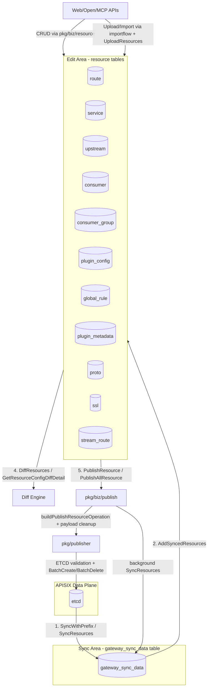
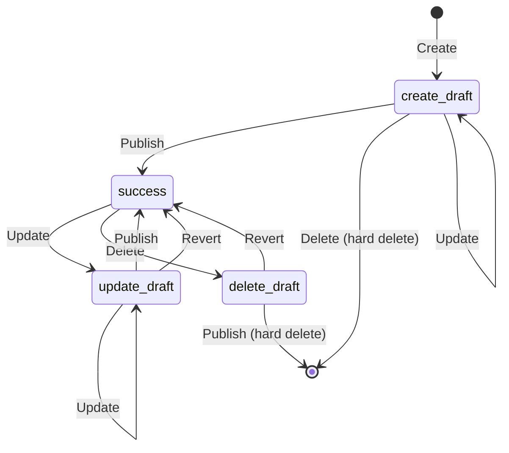
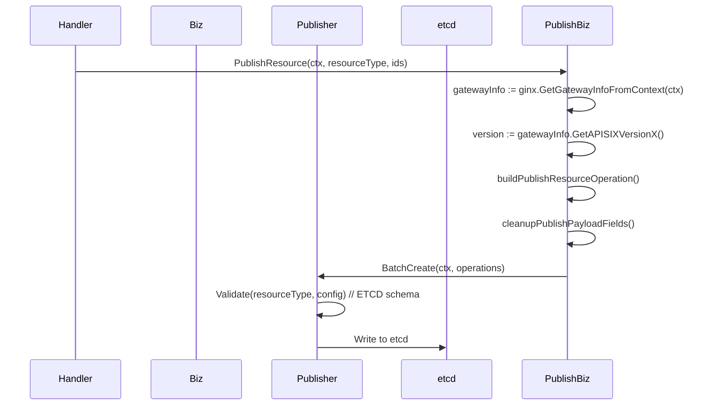

# AGENTS.md

## Code Architecture

The backend is a Gin-based control plane for managing APISIX data-plane resources.

**Typical Call Chain**: `router -> middleware -> handler/serializer -> focused biz package -> repo/infras`

Do not assume old flat `pkg/biz/*.go` ownership. The current refactor split business logic into focused
subpackages, and the root `pkg/biz` package is only a package marker.

```plaintext
pkg/
├── apis/                  # HTTP and MCP interfaces
│   ├── basic/             # Health/readiness/basic endpoints
│   ├── common/            # Shared API serializers/helpers
│   ├── mcp/               # MCP server, tools, resources, and prompts
│   ├── open/              # Public Open API
│   └── web/               # Management-console Web API
├── account/               # Account/session helpers
├── async/                 # Async task helpers
├── biz/                   # Focused business packages; root package should stay thin
│   ├── auditlog/          # Operation audit-log creation/query helpers
│   ├── diff/              # Edit-area vs sync-area diff summaries
│   ├── gateway/           # Gateway CRUD and gateway-scoped lookup helpers
│   ├── importflow/        # Import preview, classification, and validation preparation
│   ├── mcp/               # MCP token and MCP-facing resource operation helpers
│   ├── publish/           # Publish orchestration, dependency fan-out, payload cleanup, persistence
│   ├── resource/          # Shared and per-resource CRUD/query/status helpers
│   ├── schema/            # Custom plugin schema business helpers
│   ├── syncdata/          # gateway_sync_data query helpers
│   ├── system/            # System configuration helpers
│   └── unifyop/           # Sync/import/revert/export orchestration
├── repo/                  # Repository layer (generated code via gorm/gen)
│   └── *.gen.go           # Auto-generated repository code; do not edit manually
├── infras/                # Infrastructure layer
│   ├── database/          # Database connections
│   ├── storage/           # etcd storage client
│   ├── logging/           # Logging utilities
│   ├── trace/             # OpenTelemetry tracing
│   ├── sentry/            # Error tracking
│   └── leaderelection/    # Leader election for distributed scheduler
├── config/                # Configuration management
├── entity/                # Data structures
│   ├── apisix/            # APISIX resource definitions
│   ├── base/              # Base entities
│   ├── dto/               # Data transfer objects
│   └── model/             # GORM models and HandleConfig hooks
├── middleware/            # Gin middlewares
│   ├── gateway_access.go
│   ├── mcp_auth.go
│   ├── openapi_resource_check.go
│   ├── permission.go
│   ├── resource_op_check.go
│   └── ...
├── publisher/             # Low-level etcd publish operations and ETCD schema validation
├── router/                # Route registration and middleware mounting
├── status/                # Resource state machine
├── utils/                 # Utility functions
│   └── schema/            # Versioned APISIX resource/plugin schemas and validators
│       ├── 3.2/
│       ├── 3.3/
│       ├── 3.11/
│       ├── 3.13/
│       ├── 3.17/
│       └── 3.18/
└── version/               # Version information
```

**Key Patterns**:

1. **Focused Biz Packages**: Place resource CRUD in `pkg/biz/resource`, publish logic in `pkg/biz/publish`,
   sync/revert/export in `pkg/biz/unifyop`, import preparation in `pkg/biz/importflow`, and diffing in
   `pkg/biz/diff`. Do not add new cross-cutting helpers to the root `pkg/biz` package.
2. **Three Config Shapes**: Request-time validation payload, persisted DB `config`, and publish-time ETCD payload are
   distinct. Keep the conversion boundary explicit.
3. **Schema Validation**: Versioned APISIX schemas and plugin schemas live in `pkg/utils/schema/`; custom plugin schema
   lookup lives in `pkg/biz/schema`.
4. **Publisher Pattern**: `pkg/biz/publish` builds version-cleaned operations; `pkg/publisher` validates ETCD payloads
   and writes to etcd.
5. **Repository Generation**: Use `gorm/gen` for type-safe database queries (run `make mock` to regenerate).
6. **Middleware Chain**: Web/Open/MCP APIs rely on middleware to load gateway context, enforce auth/permissions, and
   run request-time resource checks.

## Layer Responsibilities

| Layer | Package | Key Responsibilities |
|-------|---------|---------------------|
| **Router** | `pkg/router` | Route registration and middleware mounting |
| **API** | `pkg/apis` | HTTP/MCP interface layer containing handlers, serializers, tools, resources, and prompts |
| **Middleware** | `pkg/middleware` | Authentication, CSRF protection, access control, gateway context injection |
| **Biz** | `pkg/biz/*` | Focused business packages for resource CRUD, publish, diff, sync/import, schema, gateway, MCP, audit, and system config |
| **Status** | `pkg/status` | Resource state machine (FSM) for lifecycle management |
| **Publisher** | `pkg/publisher` | Low-level etcd publish operations with ETCD schema validation before write |
| **Repo** | `pkg/repo` | Database operations (auto-generated by gorm/gen, DO NOT edit manually) |
| **Infras** | `pkg/infras` | Infrastructure: DB connections, etcd client, logging, tracing |
| **Model** | `pkg/entity/model` | GORM models with HandleConfig hooks for field injection |
| **DTO** | `pkg/entity/dto` | Data transfer objects for inter-layer communication |
| **Schema Utils** | `pkg/utils/schema` | Versioned APISIX schema/plugin-schema loading and validators |

### API Layer Structure

The API layer (`pkg/apis`) is organized into multiple sub-modules to serve different consumers:

| Sub-module | Package | Description |
|------------|---------|-------------|
| **Web API** | `pkg/apis/web` | Management console API for frontend/admin operations |
| **Open API** | `pkg/apis/open` | Public API for external system integration |
| **MCP API** | `pkg/apis/mcp` | MCP server exposing tools, resources, prompts, and streamable HTTP/SSE transports |
| **Basic API** | `pkg/apis/basic` | Basic endpoints (health check, readiness, etc.) |
| **Common** | `pkg/apis/common` | Shared utilities and common response handling |

Web/Open/Basic API sub-modules normally contain:

- **Handler** - HTTP request handling, parameter binding, response formatting
- **Serializer** - Request/response struct definitions with validation tags

MCP is different: read `pkg/apis/mcp/AGENTS.md` before changing MCP tools, resources, prompts, or auth flows.
MCP gateway support is restricted to APISIX `3.13.X`, `3.17.X`, and `3.18.X`.

```plaintext
pkg/apis/
├── web/                    # Web API (Management Console)
│   ├── handler/            # Request handlers
│   └── serializer/         # Request/response serialization
├── open/                   # Open API (External Integration)
│   ├── handler/            # Request handlers
│   └── serializer/         # Request/response serialization
├── mcp/                    # MCP server
│   ├── tools/              # MCP tools
│   ├── resources/          # MCP docs resources
│   └── prompts/            # MCP prompts
├── basic/                  # Basic API (Health, Readiness)
│   ├── handler/            # Basic endpoint handlers
│   └── serializer/         # Basic serializers
└── common/                 # Common utilities
```

### Biz Layer Structure

| Package | Owns |
|---------|------|
| `pkg/biz/resource` | Shared and per-resource CRUD/query/status helpers for the 11 APISIX resource tables |
| `pkg/biz/publish` | `PublishResource`, `PublishAllResource`, dependency fan-out, publish payload cleanup, and status persistence |
| `pkg/biz/diff` | `DiffResources` and change-summary calculation |
| `pkg/biz/unifyop` | etcd sync, sync-to-edit import, revert, upload commit, and etcd export orchestration |
| `pkg/biz/importflow` | Import-file indexing, classification, schema merging, ignore-field handling, and validation preparation |
| `pkg/biz/syncdata` | `gateway_sync_data` list/query/get helpers |
| `pkg/biz/schema` | Custom plugin schema CRUD and schema maps used by validation |
| `pkg/biz/mcp` | MCP token management and MCP-facing resource helpers |
| `pkg/biz/gateway` | Gateway CRUD and gateway lookup helpers |
| `pkg/biz/auditlog` | Operation audit-log creation and query helpers |
| `pkg/biz/system` | System configuration helpers such as user whitelist |

When adding or moving business logic, choose the owning subpackage above. If two packages need the same helper, prefer a
small lower-level helper in the package that owns the data or invariant instead of recreating a broad root facade.

## Layer Dependency Rules

| Layer | Can Depend On | Must NOT Depend On |
|-------|---------------|-------------------|
| Handler | Serializer, focused Biz packages, DTO/Model, Utils | Repo, Publisher, Infras |
| Serializer | Model, DTO, focused Biz packages, Schema Utils | Repo, Publisher |
| Middleware | focused Biz packages, Config, Utils, Serializer when it owns request-context data | Handler, Repo, Publisher |
| Biz | Repo, Status, Publisher, Model, DTO, Infras, focused sibling Biz packages | Handler, Middleware |
| Status | Constant, Config | Biz, Handler |
| Publisher | Infras/Storage, Constant, Model, Repo for custom plugin schema lookup | Biz, Handler |
| Repo | Model, Infras/Database | Biz, Handler |
| Infras | Config | Any business layer |
| Model/DTO | Constant | Any other layer |

`pkg/publisher` currently duplicates custom plugin schema lookup through `repo` instead of importing `pkg/biz/schema`;
keep that direction unless you are explicitly changing the layering contract.

## Design

### 1. Core Flow: Sync, Edit, Import, Diff, Publish

The apiserver manages APISIX configuration across three storage surfaces:


```mermaid
flowchart TD
    subgraph etcdLayer [APISIX Data Plane]
        ETCD[(etcd)]
    end

    subgraph syncArea [Sync Area - gateway_sync_data table]
        SyncData[(gateway_sync_data)]
    end

    subgraph editArea [Edit Area - resource tables]
        Route[(route)]
        Service[(service)]
        Upstream[(upstream)]
        Consumer[(consumer)]
        ConsumerGroup[(consumer_group)]
        PluginConfig[(plugin_config)]
        GlobalRule[(global_rule)]
        PluginMetadata[(plugin_metadata)]
        Proto[(proto)]
        SSL[(ssl)]
        StreamRoute[(stream_route)]
    end

    API[Web/Open/MCP APIs] -->|"CRUD via pkg/biz/resource"| editArea
    ETCD -->|"1. SyncWithPrefix / SyncResources"| SyncData
    SyncData -->|"2. AddSyncedResources"| editArea
    API -->|"Upload/Import via importflow + UploadResources"| editArea
    editArea -->|"4. DiffResources / GetResourceConfigDiffDetail"| DiffEngine[Diff Engine]
    editArea -->|"5. PublishResource / PublishAllResource"| Publish[pkg/biz/publish]
    Publish -->|"buildPublishResourceOperation + payload cleanup"| Publisher[pkg/publisher]
    Publisher -->|"ETCD validation + BatchCreate/BatchDelete"| ETCD
    Publish -->|"background SyncResources"| SyncData
```

#### 1.1 Key Functions in the Flow

| Step | Function | File | Description |
|------|----------|------|-------------|
| 1. Sync | `SyncWithPrefix()`, `SyncResources()`, `SyncerRun()` | `pkg/biz/unifyop/sync.go` | Fetch from etcd and upsert `gateway_sync_data` snapshots |
| 2. Manage synced resources | `AddSyncedResources()` | `pkg/biz/unifyop/sync.go` | Copy selected sync-area resources into edit-area tables |
| 3. Import preview | `BuildImportIndex()`, `ValidateImportedResources()`, `ClassifyImportResources()` | `pkg/biz/importflow/*.go` | Parse import files, merge schema state, validate, and split add/update previews |
| 3. Import commit | `PrepareImportUpload()`, `UploadResources()` | `pkg/biz/importflow/flow.go`, `pkg/biz/unifyop/sync.go` | Prepare add/update groups and write them into edit-area tables |
| 4. CRUD | `CreateXxx`, `UpdateXxx`, `BatchCreateResources`, `GetResourceUpdateStatus` | `pkg/biz/resource/*.go` | User/Open/MCP resource create/update/delete/list operations |
| 5. Diff | `DiffResources()` | `pkg/biz/diff/diff.go` | Build draft change summaries and related-resource fan-out |
| 5. Diff detail | `GetResourceConfigDiffDetail()` | `pkg/biz/unifyop/sync.go` | Compare stored edit-area config with sync-area config |
| 6. Publish | `PublishResource()`, `PublishAllResource()` | `pkg/biz/publish/entry.go` | State-machine check, publish fan-out, audit logging, background sync |
| 6. Publish payload | `buildPublishResourceOperation()`, `cleanupPublishPayloadFields()` | `pkg/biz/publish/payload.go` | Merge base info and remove version-incompatible/internal fields |
| 6. ETCD write | `BatchCreate()`, `BatchDelete()`, `Validate()` | `pkg/publisher/etcd.go` | Validate ETCD payloads and write/delete etcd keys |

#### 1.2 Storage Surface Rationale

1. **Sync Area** (`gateway_sync_data` table): Read-only mirror of etcd state
   - Updated automatically by scheduler
   - Used for diff comparison
   - Source of truth for "what's deployed"

2. **Edit Area** (individual resource tables): User-editable staging area
   - Resources have draft states (create_draft, update_draft, delete_draft)
   - Changes don't affect APISIX until published
   - Supports rollback by reverting to sync area state

3. **APISIX Data Plane** (etcd): Published runtime state
   - Written only through `pkg/biz/publish` plus `pkg/publisher`
   - Validated as `constant.ETCD` payloads before write
   - Re-synced into `gateway_sync_data` after publish

### 2. Resource State Machine

Resources follow a state machine pattern managed by `pkg/status/status.go` using the `looplab/fsm` library:


```mermaid
stateDiagram-v2
    [*] --> create_draft: Create
    create_draft --> success: Publish
    create_draft --> [*]: Delete (hard delete)
    create_draft --> create_draft: Update

    success --> update_draft: Update
    success --> delete_draft: Delete

    update_draft --> success: Publish
    update_draft --> success: Revert
    update_draft --> update_draft: Update

    delete_draft --> success: Revert
    delete_draft --> [*]: Publish (hard delete)
```

#### 2.1 State Definitions

| State | Constant | Description |
|-------|----------|-------------|
| `create_draft` | `ResourceStatusCreateDraft` | Newly created, not yet published to APISIX |
| `update_draft` | `ResourceStatusUpdateDraft` | Modified from published version, changes pending |
| `delete_draft` | `ResourceStatusDeleteDraft` | Marked for deletion, waiting for publish to remove from APISIX |
| `success` | `ResourceStatusSuccess` | Published and in sync with APISIX |

#### 2.2 Operations and State Transitions

| Current State | Operation | Next State | Notes |
|---------------|-----------|------------|-------|
| (none) | Create | `create_draft` | New resource enters draft state |
| `create_draft` | Publish | `success` | Resource written to etcd |
| `create_draft` | Delete | (deleted) | Hard delete, never published |
| `create_draft` | Update | `create_draft` | Stays in create_draft |
| `success` | Update | `update_draft` | Changes staged for publish |
| `success` | Delete | `delete_draft` | Deletion staged for publish |
| `update_draft` | Publish | `success` | Changes written to etcd |
| `update_draft` | Revert | `success` | Discard changes, restore from sync area |
| `update_draft` | Update | `update_draft` | More changes, stays in draft |
| `delete_draft` | Publish | (deleted) | Resource removed from etcd and DB |
| `delete_draft` | Revert | `success` | Cancel deletion |

#### 2.3 Usage in Code

```go
// Check if operation is allowed
statusOp := status.NewResourceStatusOp(resource)
err := statusOp.CanDo(ctx, constant.OperationTypePublish)

// Get next state after operation
nextStatus, err := statusOp.NextStatus(ctx, constant.OperationTypePublish)
```

### 3. Multi-Version APISIX Support

The system supports APISIX 3.2.X, 3.3.X, 3.11.X, 3.13.X, 3.17.X, and 3.18.X with version-aware schema validation
and field cleanup. Integration coverage includes full 3.11/3.13 plugin-matrix cases and compact representative
3.17/3.18 cases.

**Schema Breaking Change**: APISIX 3.x introduced `additionalProperties: false` which strictly enforces that NO extra fields are allowed beyond those defined in the schema.

#### 3.1 Version-Specific Field Support

| Resource | Field | 3.2.X | 3.3.X | 3.11.X | 3.13.X | 3.17.X | 3.18.X | Action |
|----------|-------|-------|-------|--------|--------|--------|--------|--------|
| `route` | name | Yes | Yes | Yes | Yes | Yes | Yes | Always keep |
| `service` | name | Yes | Yes | Yes | Yes | Yes | Yes | Always keep |
| `upstream` | name | Yes | Yes | Yes | Yes | Yes | Yes | Always keep |
| `plugin_config` | name | Yes | Yes | Yes | Yes | Yes | No | Remove in 3.18 |
| `consumer` | id | No | No | No | No | No | No | Always remove (uses username) |
| `consumer_group` | name | No | No | No | Yes | Yes | No | Keep only in 3.13/3.17 |
| `stream_route` | name | No | No | No | Yes | Yes | No | Keep only in 3.13/3.17 |
| `proto` | name | No | No | No | Yes | Yes | No | Keep only in 3.13/3.17 |
| `global_rule` | name | No | No | No | No | No | No | Always remove |
| `ssl` | name | No | No | No | No | No | No | Always remove |
| `consumer_group` | id | No | No | Required | Required | Required | No | Remove in 3.18; otherwise inject when required |
| `plugin_config` | id | Present | Present | Required | Required | Required | Optional | Inject only when required |
| `global_rule` | id | Present | Present | Required | Required | Required | Optional | Inject only when required |

#### 3.2 Key Functions for Version Handling

```go
// pkg/constant/resource_schema.go

// Check if name field is supported for a version
ResourceSupportsNameFieldForVersion(resourceType, version) bool

// Check if field should be removed before publish
ShouldRemoveFieldBeforeValidationOrPublish(resourceType, fieldName, version) bool

// Check if resource requires ID in the current schema baseline
ResourceRequiresIDInSchema(resourceType) bool

// Check if resource requires ID in a specific APISIX version schema
ResourceRequiresIDInSchemaForVersion(resourceType, version) bool
```

#### 3.3 Version Detection Flow


```mermaid
sequenceDiagram
    participant Handler
    participant Biz
    participant Publisher
    participant etcd

    Handler->>PublishBiz: PublishResource(ctx, resourceType, ids)
    PublishBiz->>PublishBiz: gatewayInfo := ginx.GetGatewayInfoFromContext(ctx)
    PublishBiz->>PublishBiz: version := gatewayInfo.GetAPISIXVersionX()
    PublishBiz->>PublishBiz: buildPublishResourceOperation()
    PublishBiz->>PublishBiz: cleanupPublishPayloadFields()
    PublishBiz->>Publisher: BatchCreate(ctx, operations)
    Publisher->>Publisher: Validate(resourceType, config) // ETCD schema
    Publisher->>etcd: Write to etcd
```

#### 3.4 Schema Verify and Update

The schema directories are `pkg/utils/schema/{version}/schema.json` and
`pkg/utils/schema/{version}/plugin.json` for `3.2`, `3.3`, `3.11`, `3.13`, `3.17`, and `3.18`.

- `schema.json` is the APISIX resource schema.
- `plugin.json` is the APISIX plugin list/schema source.
- `pkg/utils/schema/plugin.go` also has APISIX-type-specific plugin maps for `apisix`, `tapisix`, and `bk-apisix`.
- When changing field compatibility rules, update `pkg/constant/resource_schema.go` and its tests together with
  schema/plugin fixtures.

### 4. Resource Field Management

#### 4.1 HandleConfig Pattern

All resource models implement a `HandleConfig()` method called by GORM hooks (BeforeCreate/BeforeUpdate/BeforeSave) to inject fields into the `config` JSON column:

**Purpose**: Sync database column values into the config JSON for internal use and APISIX compatibility.

**Persistence Contract**:

- `HandleConfig()` is the save-time materialization boundary for all 11 APISIX resource models.
- Before a row is inserted or updated, `HandleConfig()` must write the model-owned identity fields and association fields back into `config`.
- Therefore, the `config` stored in the database is expected to be a complete persisted config, not a raw request payload and not a publish-time temporary shape.
- Refactors, cleanups, publish/sync optimizations, and similar changes must not move, weaken, or bypass this contract. If behavior changes are needed, treat them as explicit contract changes and prove them with targeted `HandleConfig()` tests first.

**Example** (`pkg/entity/model/route.go`):

```go
func (r *Route) HandleConfig() error {
    // Inject id and name
    r.Config, _ = sjson.SetBytes(r.Config, "id", r.ID)
    if r.Name != "" {
        r.Config, _ = sjson.SetBytes(r.Config, "name", r.Name)
    }
    // Inject association fields (required by APISIX)
    if r.ServiceID != "" {
        r.Config, _ = sjson.SetBytes(r.Config, "service_id", r.ServiceID)
    }
    return nil
}
```

**Field Categories**:

1. **Identity fields** (`id`, `name`): Duplicated from columns, removed before publish based on version
2. **Association fields** (`service_id`, `upstream_id`, `plugin_config_id`): Required by APISIX, kept during publish
3. **Internal fields** (`validity_start`, `validity_end` for SSL): Never sent to APISIX

#### 4.2 Publish Field Cleanup

Before publishing to APISIX/etcd, `pkg/biz/publish/payload.go` removes fields based on version compatibility using
`ShouldRemoveFieldBeforeValidationOrPublish()`. It also removes publish-only internal fields such as SSL
`validity_start` / `validity_end` and stream-route `labels`.

### 5. Schema Validation

#### 5.1 DATABASE Validation

- **When**: Web serializer validation, Open API middleware validation, and import validation before `HandleConfig()`
- **Purpose**: Validate user-provided config is valid for APISIX
- **Constraint**: Looser than publish validation; can validate temporary payloads that include generated IDs or names
  needed by the target APISIX schema
- **Datatype**: `constant.DATABASE`
- **Key helpers**:
  - Web API: `pkg/apis/web/serializer.CheckAPISIXConfig()` and `prepareWebValidationPayload()`
  - Open API: `pkg/middleware.OpenAPIResourceCheck()` and `prepareOpenValidationPayload()`
  - Import: `pkg/biz/importflow.ValidateImportedResources()`
  - Shared validation shaping: `pkg/biz/resource.InjectGeneratedIDForValidation()` and
    `pkg/biz/resource.BuildConfigRawForValidation()`
- **Example**: callers do not need to provide `id` for `consumer_group`, `plugin_config`, or `global_rule` when the
  versioned schema requires a server-generated validation ID

#### 5.2 ETCD Validation

- **When**: Publisher validation before writing to etcd (after HandleConfig and field cleanup)
- **Purpose**: Ensure config sent to APISIX is complete and valid
- **Constraint**: Strict, `additionalProperties: false`, all required fields must be present
- **Datatype**: `constant.ETCD`
- **Key helpers**: `pkg/biz/publish.buildPublishResourceOperation()`,
  `pkg/biz/publish.cleanupPublishPayloadFields()`, and `pkg/publisher.EtcdPublisher.Validate()`
- **Example**: `consumer_group` must have `id` in config when publishing to APISIX 3.11/3.13/3.17,
  but APISIX 3.18 rejects that field

### 5.3 Validation Flow

```plaintext
User Request / Import File
    ↓
[Request-Time DATABASE Validation]
    - Web: validation.BindAndValidate() -> serializer.CheckAPISIXConfig()
    - Open: middleware.OpenAPIResourceCheck()
    - Import: importflow.ValidateImportedResources()
    - May inject temporary id/name for validation only
    - May remove version-incompatible id/name before validation
    PASS
    ↓
[Handler / Biz]
    - Web/Open/MCP CRUD writes through pkg/biz/resource
    - Import commit writes through importflow.PrepareImportUpload() + unifyop.UploadResources()
    ↓
[Model.HandleConfig()] GORM Hook
    - Injects id, name, association fields into config
    - Stores complete persisted DB config
    ↓
[Publish Biz]
    - Reads persisted DB config
    - Merges APISIX BaseInfo into payload
    - Removes version-incompatible/internal publish fields
    ↓
[Publisher ETCD Validation]
    - NewAPISIXJsonSchemaValidator(..., constant.ETCD)
    - Strict validation before etcd write
    PASS
    ↓
Write to etcd -> APISIX
```

## Build and test commands

**Go Version Requirement**: Go 1.25.5+

Always confirm Go version before build/test/lint.

Use this order strictly (stop when one works):

1. If you are already in `src/apiserver`, use local `.envrc` first:

```shell
# from src/apiserver
[ -f .envrc ] && source .envrc
go version
which go
```

2. If `.envrc` is missing or does not provide Go 1.25.5+, use explicit Go binary:

```shell
/root/.gvm/gos/go1.25.5/bin/go version
```

If you need `go` command (for `make test`, `make lint`, etc.), prepend PATH in the same shell:

```shell
export PATH=/root/.gvm/gos/go1.25.5/bin:$PATH
go version
```

3. If both methods fail, ask the user to provide the correct Go toolchain path.

There is a `Makefile` in the `src/apiserver` directory; use it to build and test the project.

### Build

```shell
# update the dependencies
make dep

# build the binary
make build
```

### Test

```shell
# run unittest
make test

# run a focused package test
go test ./pkg/biz/publish -run TestPublishConsumerGroups -v

# clear test cache
go clean -testcache

```

### Integration Test

Integration tests in tests/integration/ with Docker Compose setup

```shell
# run integration test
make integration-test
```

### Code Quality

```shell
# run code quality check, it will run fmt, vet, lint commands.
make lint
```

For code changes, run the relevant focused tests first, then `make lint` and `make test` before finishing or pushing.
Fix any issues you introduced.

If the change only touches Markdown documentation files (for example `*.md`), you can skip `make lint` and `make test`.

## Local Tools Installed

- `rg`, `ag`, and `grep` for command-line text search
- `jq` for command-line JSON processing
- `gh` for github cli tools

## Important Notes

- License Headers: All Go files must have license headers (auto-added by pre-commit hook)
- Vendor Dependencies: Run make dep after modifying go.mod to update vendor directory
- Database Migrations: Use ./apiserver migrate command for schema changes
- Two Validation Contexts: Remember DATABASE (input) vs ETCD (output) have different requirements
